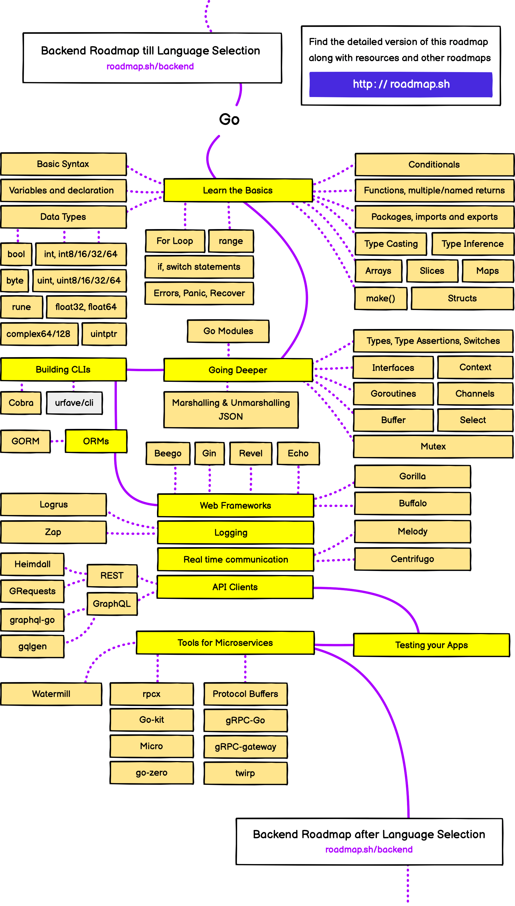

# golang developer roadmap

This map is showing the learning road line for all go developers,
click [here](https://roadmap.sh/golang) to show the whole and more maps if you will.

* [Learn the Basics](#learn-the-basics)
* [Go advanced](#go-advanced)
* [Building CLI Applications](#building-cli-applications)
* [ORMs](#orms)
* [Web Frameworks](#web-frameworks)
* [Logging](#logging)
* [Go realtime communication](#go-realtime-communication)
* [API Clients](#api-clients)
* [Testing Go Code](#testing-go-code)
* [Microservices](#microservices)

## Learn the Basics

Learn the common concepts of Go like variables, loops, conditional statements, functions,
data types, and so on. A good starting point for go basics is its Go’s official docs.

Visit the following resources to learn more:

* [Official Go Tutorial](https://go.dev/doc/tutorial/)
* [Go Tutorial](https://www.w3schools.com/go/index.php)

## Go advanced

### Modules

Go modules are a group of related packages that are versioned and distributed together. They specify the requirements of
our project, list all the required dependencies, and help us keep track of the specific versions of installed
dependencies.

Modules are identified by a module path that is declared in the first line of the go.mod file in our project.

Visit the following resources to learn more:

- [Go Modules](https://go.dev/blog/using-go-modules)
- [Go Modules](https://www.youtube.com/watch?v=9cV1KESTJRc)
- [DigitalOcean: How to use Go Modules](https://www.digitalocean.com/community/tutorials/how-to-use-go-modules)
- [Go Modules Explained in 5 Minutes (by Golang Dojo on YouTube)](https://youtu.be/7xSxIwWJ9R4)
- [How to create a module in Go](https://go.dev/doc/tutorial/create-module)
- [How to use modules in Go](https://go.dev/blog/using-go-modules)
- [How to modify existing projects to use Go modules](https://jfrog.com/blog/converting-projects-for-go-modules/)

### Working with json

JSON (JavaScript Object Notation) is a simple data interchange format. Syntactically it resembles the objects and lists
of JavaScript. It is most commonly used for communication between web back-ends and JavaScript programs running in the
browser, but it is used in many other places, too.

Visit the following resources to learn more:

- [JSON](https://go.dev/blog/json)
- [Guide to JSON in Golang](https://www.sohamkamani.com/golang/json/)
- [JSON to GO](https://mholt.github.io/json-to-go/)
- [Comprehensive Guide to using JSON in Go](https://betterstack.com/community/guides/scaling-go/json-in-go/)

### Types and type assertions

Type assertions in Golang provide access to the exact type of variable of an interface.

Visit the following resources to learn more:

* [Types Assertions](https://go.dev/tour/methods/15)
* [Type Assertion](https://www.geeksforgeeks.org/type-assertions-in-golang/)

### Interfaces

An interface in Go, is a type that defines a set of methods. If we have a type (e.g. struct) that implements that set of
methods, then we have a type that implements this interface.

Visit the following resources to learn more:

- [Go Interfaces](https://go.dev/tour/methods/9)
- [Effective Go: Interfaces](https://go.dev/doc/effective_go#interfaces)
- [Go by Example: Interfaces](https://gobyexample.com/interfaces)
- [Golang Tutorial #22 - Interfaces (by Tech With Tim on YouTube)](https://www.youtube.com/watch?v=lh_Uv2imp14)
- [Learn Go Interfaces](https://www.youtube.com/watch?v=KB3ysH8cupY)
- [Understanding Go Interfaces](https://www.youtube.com/watch?v=qJKQZKGZgf0)

### Context

The `context` package provides a standard way to solve the problem of managing the state during a request. The package
satisfies the need for request-scoped data and provides a standardized way to handle: Deadlines, Cancellation Signals,
etc.

Visit the following resources to learn more:

- [Go Context](https://pkg.go.dev/context)
- [Go by Example: Context](https://gobyexample.com/context)
- [Digital Ocean: How to Use Contexts in Go](https://www.digitalocean.com/community/tutorials/how-to-use-contexts-in-go)
- [Context in Go](https://www.youtube.com/watch?v=LSzR0VEraWw)
- [Understanding Contexts in Go](https://youtu.be/h2RdcrMLQAo)

### Goroutines

Goroutines allow us to write concurrent programs in Go. Things like web servers handling thousands of requests or a
website rendering new pages while also concurrently making network requests are a few example of concurrency.

In Go, each of these concurrent tasks are called`Goroutines`.

Visit the following resources to learn more:

- [Goroutines](https://go.dev/tour/concurrency/1)
- [Effective Go: Goroutines](https://go.dev/doc/effective_go#goroutines)
- [Goroutines in Golang](https://www.geeksforgeeks.org/goroutines-concurrency-in-golang)
- [GoRoutines](https://www.youtube.com/watch?v=LvgVSSpwND8)
- [Understanding Concurrency](https://www.youtube.com/watch?v=V-0ifUKCkBI)
- [Go by Example: Goroutines](https://gobyexample.com/goroutines)
- [Golang Goroutine Basics You MUST Learn! (by Golang Dojo on YouTube)](https://youtu.be/oHIbeTmmTaA)

### Channels

Channels are the pipes that connect concurrent goroutines. You can send values into channels from one goroutine and
receive those values into another goroutine.

Channels are a typed conduit through which you can send and receive values with the channel operator,`<-`.

Visit the following resources to learn more:

- [Channels](https://go.dev/tour/concurrency/2)
- [Effective Go: Channels](https://go.dev/doc/effective_go#channels)
- [Go by Example: Channels](https://gobyexample.com/channels)
- [Channels in Golang](https://golangbot.com/channels/)
- [Channels](https://www.youtube.com/watch?v=e4bu9g-bYtg)
- [GeeksForGeeks: Channel in Golang](https://www.geeksforgeeks.org/channel-in-golang/)
- [Golang Channel Basics You must Know!](https://youtu.be/LgCmPHqAuf4)

### Buffer

The`buffer`belongs to the byte package of the Go language, and we can use these package to manipulate the byte of the
string.

Visit the following resources to learn more:

- [Buffer Examples](https://pkg.go.dev/bytes#example-Buffer)
- [Buffer](https://www.educba.com/golang-buffer/)
- [Buffers in Golang](https://www.youtube.com/watch?v=NoDRq6Twkts)

### Select

The`select`statement lets a goroutine wait on multiple communication operations.

A`select`blocks until one of its cases can run, then it executes that case. It chooses one at random if multiple are
ready. The`select`statement is just like switch statement, but in the select statement, case statement refers to
communication, i.e. sent or receive operation on the channel.

Visit the following resources to learn more:

- [Select](https://go.dev/tour/concurrency/5)
- [Go by Example: Select](https://gobyexample.com/select)
- [Select in Golang](https://www.geeksforgeeks.org/select-statement-in-go-language/)
- [Select Statement](https://www.youtube.com/watch?v=1c7ttSJDMAI)

### Mutex

Go allows us to run code concurrently using goroutines. However, when concurrent processes access the same piece of
data, it can lead to[race conditions](https://www.sohamkamani.com/golang/data-races/). Mutexes are data structures
provided by the[sync](https://pkg.go.dev/sync/)package. They can help us place a lock on different sections of data so
that only one goroutine can access it at a time.

Visit the following resources to learn more:

- [Using a Mutex in Go with Examples](https://www.sohamkamani.com/golang/mutex/)

## Building CLI Applications

Command line interfaces (CLIs), unlike graphical user interfaces (GUIs), are text-only. Cloud and
infrastructure applications are primarily CLI-based due to their easy automation and remote capabilities.

Go applications are built into a single self contained binary making installing Go applications trivial;
specifically, programs written in Go run on any system without requiring any existing libraries, runtimes,
or dependencies. And programs written in Go have an immediate startup time—similar to C or C++ but
unobtainable with other programming languages.

Visit the following resources to learn more:

* [Command-line Interfaces (CLIs)](https://go.dev/solutions/clis)

click to show details

### Cobra

Cobra is a library for creating powerful modern CLI applications.

Visit the following resources to learn more:

- [Cobra Github Repo](https://github.com/spf13/cobra)
- [Cobra Website](https://cobra.dev/)
- [Cobra Package Documentation](https://pkg.go.dev/github.com/spf13/cobra)

### Urfave cli

Urfave cli is a simple, fast, and fun package for building command line apps in Go.

Visit the following resources to learn more:

- [Urfave cli Github Repo](https://github.com/urfave/cli)
- [Urfave cli Website](https://cli.urfave.org/)
- [How to Build cli in Go](https://blog.hackajob.co/how-to-build-cli-in-go/)
- [Building CLI using urfave cli](https://zerokspot.com/weblog/2021/01/25/building-a-cli-using-urfave-cli/)

### Survey

A library for building interactive and accessible prompts on terminals supporting ANSI escape sequences.

* [survey repository](https://github.com/go-survey/survey)

## ORMs

Object–relational mapping (ORM, O/RM, and O/R mapping tool) in computer science is a programming technique for
converting data between type systems using object-oriented programming languages. This creates, in effect, a “virtual
object database”, hence a layer of abstraction, that can be used from within the programming language.

Most common ORM library in Go is [GORM](https://gorm.io/).

## Web Frameworks

There are several famous web frameworks for Go. Most common ones being:

* [Beego](https://github.com/beego/beego)
* [Gin](https://github.com/gin-gonic/gin)
* [Revel](https://revel.github.io/tutorial/index.html)
* [Echo](https://github.com/labstack/echo)
* [Fiber](https://github.com/gofiber/fiber)
* [Gorilla](https://github.com/gorilla)
* [Buffalo](https://github.com/gobuffalo/buffalo)

Visit the following resources to learn more:

* [Comparison of Web Frameworks](https://github.com/diyan/go-web-framework-comparison)

click to show details

### Beego

Beego is used for rapid development of enterprise application in Go, including RESTful APIs, web apps and backend
services. It is inspired by Tornado, Sinatra and Flask. beego has some Go-specific features such as interfaces and
struct embedding.

Visit the following resources to learn more:

- [Github Repository](https://github.com/beego/beego)

### Gin

Gin is a high-performance HTTP web framework written in Golang (Go). Gin has a martini-like API and claims to be up to
40 times faster. Gin allows you to build web applications and microservices in Go.

Visit the following resources to learn more:

- [Gin](https://github.com/gin-gonic/gin)
- [Gin Web Framework](https://pkg.go.dev/github.com/gin-gonic/gin)

### Revel

Revel organizes endpoints into Controllers. They provide easy data binding and form validation. Revel makes Go Templates
simple to use at scale. Register functionality to be called before or after actions.

Visit the following resources to learn more:

- [Revel](https://revel.github.io/tutorial/index.html)
- [Revel Packages](https://pkg.go.dev/github.com/revel/revel)

### Echo

Echo is a performance-focused, extensible, open-source Go web application framework. It is a minimalist web framework
that stands between stdlib + router and a full-stack web framework.

Visit the following resources to learn more:

- [Github Repository](https://github.com/labstack/echo)
- [Official Website](https://echo.labstack.com/)

### Gorilla

Gorilla is a web toolkit for the Go programming language that provides useful, composable packages for writing
HTTP-based applications.

Visit the following resources to learn more:

- [Github Repository](https://github.com/gorilla)
- [Official Website](https://www.gorillatoolkit.org/)

### Gofiber

Go Fiber is an Express-inspired framework for Golang. Go Fiber is a web framework built on top of fast HTTP. It can be
used to handle operations such as routing/endpoints, middleware, server request, etc.

Visit the following resources to learn more:

- [Github Repository](https://github.com/gofiber/fiber)
- [Official Website Docs](https://docs.gofiber.io/)

### Buffalo

Buffalo helps you to generate a web project that already has everything from front-end (JavaScript, SCSS, etc.) to the
back-end (database, routing, etc.) already hooked up and ready to run. From there it provides easy APIs to build your
web application quickly in Go.

Visit the following resources to learn more:

- [Github Repository](https://github.com/gobuffalo/buffalo)
- [Official Website Docs](https://gobuffalo.io/)

## Logging

Go has built-in features to make it easier for programmers to implement logging. Third parties have also built
additional tools to make logging easier.

Visit the following resources to learn more:

* [Logging in Go: Choosing a System and Using it](https://www.honeybadger.io/blog/golang-logging/)
* [Logging in Golang – How to Start](https://www.loggly.com/use-cases/logging-in-golang-how-to-start/)

click to show details

### Apex

Structured logging package for Go. Visit the following resources to learn more:

* [GitHub Repository](https://github.com/apex/log)

### Zerolog

The zerolog package provides a fast and simple logger dedicated to JSON output.

Zerolog’s API is designed to provide both a great developer experience and stunning performance. Its unique chaining API
allows zerolog to write JSON (or CBOR) log events by avoiding allocations and reflection.

Visit the following resources to learn more:

* [GitHub Repository](https://github.com/rs/zerolog)

### Zap

Blazing fast, structured, leveled logging in Go. Visit the following resources to learn more:

* [GitHub Repository](https://github.com/uber-go/zap)

## Go realtime communication

### Melody

Melody is websocket framework based on github.com/gorilla/websocket that abstracts away the tedious parts of handling
websockets. It gets out of your way so you can write real-time apps.

Visit the following resources to learn more:

* [GitHub Repository](https://github.com/olahol/melody)

### Centrifugo

Centrifugo is an open-source scalable real-time messaging server. Centrifugo can instantly deliver messages to
application online users connected over supported transports (WebSocket, HTTP-streaming, SSE/EventSource, GRPC, SockJS,
WebTransport). Centrifugo has the concept of a channel – so it’s a user-facing PUB/SUB server.

Visit the following resources to learn more:

* [GitHub Repository](https://github.com/centrifugal/centrifugo)
* [Getting started](https://centrifugal.dev/docs/getting-started/introduction)

## API Clients

An API client is a set of tools and protocols that operate from an application on a computer. They help you to bypass
some operations when developing a web application rather than reinventing the wheel every time. Using a client API is a
great way to speed up the development process.

Visit the following resources to learn more:

* [API Clients](https://rapidapi.com/blog/api-glossary/client/)

click to show details

### REST

REST (Representational State Transfer) API (Application Programming Interface) is used to deliver user functionality
when dealing with websites. HTTP requests are used to communicate with REST APIs so users can navigate a URL website.
These URLs can return certain information that is stored as part of the API.

Visit the following resources to learn more:

- [Tutorial](https://go.dev/doc/tutorial/web-service-gin)
- [RESTful APIs Series](https://youtube.com/playlist?list=PLzUGFf4GhXBL4GHXVcMMvzgtO8-WEJIoY)
- [Introduction to RESTful APIs](https://www.geeksforgeeks.org/rest-api-introduction/)

### Heimdall

Heimdall is an HTTP client that helps your application make a large number of requests, at scale. With Heimdall, you
can:

- Use a hystrix-like circuit breaker to control failing requests
- Add synchronous in-memory retries to each request, with the option of setting your own retrier strategy
- Create clients with different timeouts for every request

All HTTP methods are exposed as a fluent interface.

Visit the following resources to learn more:

- [GitHub Repository](https://github.com/gojek/heimdall)

### Grequests

Golang implementation of Python Grequests library(one of well known HTTP Library in Python).

Features:

- Responses can be serialized into JSON and XML
- Easy file uploads
- Easy file downloads
- Support for the following HTTP verbs GET, HEAD, POST, PUT, DELETE, PATCH, OPTIONS

Visit the following resources to learn more:

- [GitHub Repository](https://github.com/levigross/grequests)

### Graphql

`GraphQL`is a query language for[APIs](https://developer.mozilla.org/en-US/docs/Glossary/API), it offers a service that
prioritizes giving just the data that the client requested and no more.

Besides, you don’t need to be worried about breaking changes, versioning and backwards compatibility like REST APIs.
Therefore you can implement your version and auto-document your API just by using`GraphQL`.

Visit the following resources to learn more:

- [GraphQL Website](https://graphql.org/)
- [Learn GraphQL](https://graphql.org/learn/)
- [GraphQL Tutorials](https://www.graphql.com/tutorials/)
- [Red Hat: What is GraphQL?](https://www.redhat.com/en/topics/api/what-is-graphql)
- [Digital Ocean: An Introduction to GraphQL](https://www.digitalocean.com/community/tutorials/an-introduction-to-graphql)
- [How to GraphQL: The Fullstack Tutorial for GraphQL](https://www.howtographql.com/)
- [GraphQL Full Course - Novice to Expert (by freeCodeCamp.org on YouTube)](https://www.youtube.com/watch?v=ed8SzALpx1Q)
- [Beginner GraphQL Series (by Ben Awad on YouTube)](https://www.youtube.com/playlist?list=PLN3n1USn4xln0j_NN9k4j5hS1thsGibKi)

### Graphql go

A `GraphQL` package for`Go`.

Visit the following resources to learn more:

- [Graphql-go homepage](https://graphql-go.github.io/graphql-go.org/)
- [Graphql-go documentation](https://pkg.go.dev/github.com/graphql-go/graphql)
- [Github Repository](https://github.com/graphql-go/graphql)
- [GraphQL-Go - Golang Tutorial (by TechPractice on YouTube)](https://www.youtube.com/watch?v=YK7BQfQ84ws)

### Gqlgen

According to their documentation, it’s a Golang library for building GraphQL servers without much effort.

Visit the following resources to learn more:

- [Gqlgen website documentation](https://gqlgen.com/)
- [Introducing gqlgen: a GraphQL Server Generator for Go](https://99designs.com.au/blog/engineering/gqlgen-a-graphql-server-generator-for-go/)
- [GraphQL in Go - GQLGen Tutorial (by acklackl on YouTube)](https://www.youtube.com/watch?v=O6jYy421tGw)

## Testing Go Code

Go has a built-in testing command that we can use to test our program.

Visit the following resources to learn more:

* [Official Go Tutorial: Add a test](https://go.dev/doc/tutorial/add-a-test)
* [Go by Example: Testing](https://gobyexample.com/testing)
* [YourBasic Go: Table-driven unit tests](https://yourbasic.org/golang/table-driven-unit-test/)
* [Learn Go with Tests](https://quii.gitbook.io/learn-go-with-tests/)

## Microservices

Microservices are an architectural approach to software development that allows the creation of a distributed
application from deployable services that allow communication through a well-defined API. Being a solution to monoliths.

Visit the following resources to learn more:

* [Introduction to microservices](https://developer.ibm.com/learningpaths/get-started-application-modernization/intro-microservices/introduction/)
* [Microservice Patterns and Resources by Chris Richardson](https://microservices.io/index.html)
* [Microservices AntiPatterns and Pitfalls - Mark Richards](https://www.oreilly.com/content/microservices-antipatterns-and-pitfalls/)
* [Building Microservices, 2nd Edition - Sam Newman](https://samnewman.io/books/building_microservices_2nd_edition/)

click to show details

### Watermill

Watermill is an event streaming library for handling asynchronous requests in go. It provides multiple sets of
implementations for pub/sub. e.g: You can use conventional pub/sub implementations like Kafka or RabbitMQ, but also HTTP
or MySQL binlog, if that fits your use case.

Visit the following resources to learn more:

- [Watermill Website](https://watermill.io/)

### Rpcx

Rpcx is a RPC (Remote Procedure Call) framework like Alibaba Dubbo and Weibo Motan. Some of the advantages on using
Rpcx:

- Simple: easy to learn, easy to develop, easy to integrate and easy to deploy
- Performance: high performance (>= grpc-go)
- Cross-platform: support raw slice of bytes, JSON, Protobuf and MessagePack. Theoretically it can be used with java,
  php, python, c/c++, node.js, c# and other platforms
- Service discovery and service governance: support zookeeper, etcd and consul.

Visit the following resources to learn more:

- [Rpcx English Documentation](https://en.doc.rpcx.io/)
- [Rpcx Github](https://github.com/smallnest/rpcx)
- [Rpcx Official Website](https://rpcx.io/)

### Go kit

Go kit is a programming toolkit for building microservices (or elegant monoliths) in Go. it solves common problems in
distributed systems and application architecture so you can focus on delivering business value.

Visit the following resources to learn more:

- [Go-kit Website](https://gokit.io/)
- [Microservices in Go using the Go kit](https://dev.to/eminetto/microservices-in-go-using-the-go-kit-jjf)
- [Building Microservices with the Go Kit Toolkit](https://www.youtube.com/watch?v=sjd2ePF3CuQ)

### Micro

It is an API first development platform. It leverages the microservices architecture pattern and provides a set of
services which act as the building blocks of a platform.

Visit the following resources to learn more:

- [Official Website](https://micro.dev/)
- [Micro Github](https://github.com/micro/micro)

### go-zero

go-zero is a web and rpc framework with lots of engineering best practices builtin. It’s born to ensure the stability of
the busy services with resilience design, and has been serving sites with tens of millions users for years.

Visit the following resources to learn more:

- [Go-zero](https://go-zero.dev/)
- [Go-zero Docs](https://go-zero.dev/docs/introduction)
- [GitHub Repository](https://github.com/zeromicro/go-zero)

### Protocol buffers

Protocol Buffers(Protobuf) is a free, open-source, language-neutral, platform-neutral, extensible data format used to
serialize structured data. It’s like JSON, except it’s smaller and faster, and it generates native language bindings.

Some of the advantages of using protocol buffers include:

- Compact data storage
- Fast parsing
- Availability in many programming languages
- Optimized functionality through automatically-generated classes

Visit the following resources to learn more:

- [Protobuf Github](https://github.com/protocolbuffers/protobuf/)
- [Protobuf Doc](https://developers.google.com/protocol-buffers/)
- [Protobuf with Go](https://developers.google.com/protocol-buffers/docs/gotutorial/)

### gRPC Go

Go language implementation of gRPC(gRPC is a technology for implementing RPC APIs).

Visit the following resources to learn more:

- [gRPC-go Github](https://github.com/grpc/grpc-go/)
- [gRPC-go Doc](https://pkg.go.dev/google.golang.org/grpc/)
- [Basic tutorial introduction to gRPC in Go.](https://grpc.io/docs/languages/go/basics/)

### Grpc gateway

gRPC-Gateway creates a layer over gRPC services that will act as a RESTful service to a client. It is a plugin of
protoc. It reads a gRPC service definition and generates a reverse-proxy server which translates a RESTful JSON API into
gRPC.

Visit the following resources to learn more:

- [Grpc-gateway Github](https://github.com/grpc-ecosystem/grpc-gateway/)
- [Grpc-gateway Doc](https://grpc-ecosystem.github.io/grpc-gateway/)

### Twirp

Twirp is a framework for service-to-service communication emphasizing simplicity and minimalism. It generates routing
and serialization from API definition files and lets you focus on your application’s logic instead of thinking about
folderol like HTTP methods and paths and JSON.

Twirp is similar to gRPC, but without the custom HTTP server and transport implementations: it runs on the standard
library’s extremely-well-tested-and-high-performance net/http Server. It can run on HTTP 1.1, not just http/2, and
supports JSON serialization for easy debugging.

Visit the following resources to learn more:

- [GitHub Repository](https://github.com/twitchtv/twirp)
- [Getting started](https://twitchtv.github.io/twirp/docs/intro.html)

